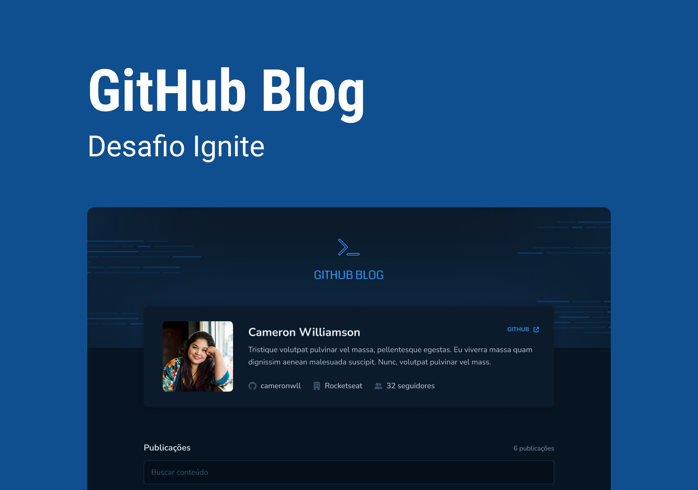

<div align="center">
    
    <p>A blog application</p>
</div>



## 💻 Overview
This application was developed as challenge of Ignite program by RocketSeat. The Github Blog app is a simple example of using the GitHub API to fetch issues from a repository, data from your profile and display them as a blog based on a design created by RocketSeat.

[](https://www.figma.com/file/cozM0289GXpHj3Ro8lhdrK/GitHub-Blog-(Community)?type=design&node-id=2%3A1550&mode=design&t=TkpihdxQMvV8d7f2-1)

## ✅ Features

- [x] Listing of your profile with image, number of followers, name and other information available via the GitHub API
- [x] List and filter all issues in the repository with a small summary of their content
- [x] Page to display a complete post (issue)

## 🚀 Tech Stack

The following tools were used in the construction of the project:

<code></code>
<code></code>
<code></code>
<code></code>

## 👉 Run project
Before you begin, you will need to have the following tools installed on your machine:
[Git](https://git-scm.com), [npm](https://www.npmjs.com/)
In addition, it is good to have an editor to work with the code like [VSCode](https://code.visualstudio.com/).

```bash

# Clone this repository
$ git clone https://github.com/KassiaMabily/ignite-shop.git

# go to the project folder
$ cd ignite-shop

# install dependencies
$ npm i

# run
$ npm run dev

```
